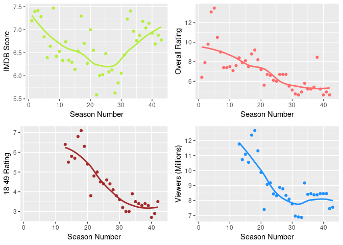
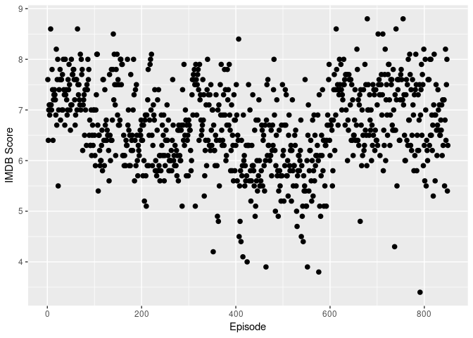
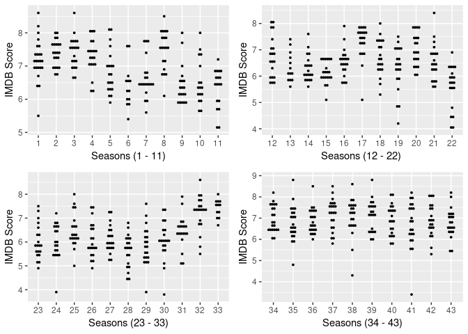
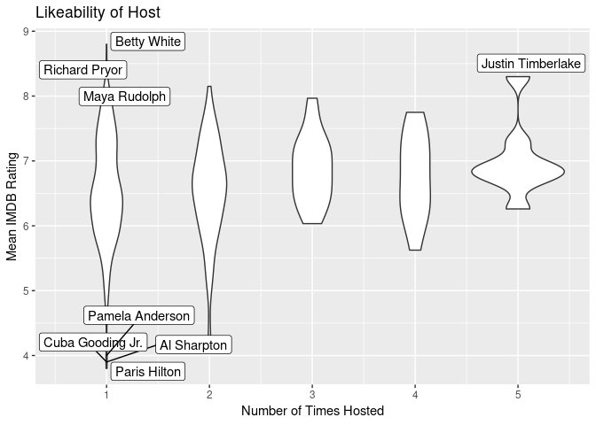
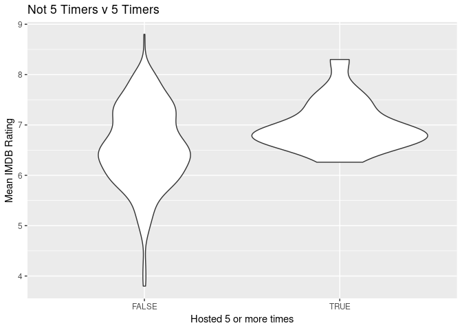

Saturday Night Live Data and Why?
---------------------------------

After gathering data from wikipedia and IMDB on Saturday Night Live
episodes, hosts, and ratings, we are trying to discover how the
perception of Saturday Night Live has changed over time. This relates to
ratings and viewership. We are also seeking to find out if bringing in a
popular host can positively impact the ratings. Likewise, SNL has a five
timers club which is composed of any hosts who have hosted at least five
times. We will be analyzing this group as well to see if there is a
positive correlation between the ratings of the episode and the hosts
who are in the five timers club.

How has SNL Done throughout the Years?
--------------------------------------

These plots show IMDB ratings, overall rating, 18-49 rating, and viewers
in millions by season. Each of these plots show a decrease as time
progresses. Especially noting that seasons 31-33 had very poor reviews
and viewership. While it has improved a little since then, the reviews
and quantity of viewers is nowhere near what it had been initially.

Theses plots shows the changes in mean IMDB rating, overall rating from
TV Ratings Guide, the 18-49 rating, and viewers in millions as time has
changed. Every category other than IMDB score shows a pretty consistant
decrease as time has progressed. I wonder why? With IMDB Ratings we are
able to break the ratings down to each episode in each season.

Let us break it down by Season
------------------------------

Woah! Let us make this data more digestable!

Here we can see that most seasons are centered within 2 ratings of their
mean value. But we can clearly see some episodes BOMBED! ... and some
episodes did really well! Let us look at some possible reasons.

Hosts and Musical Guests
------------------------

Perhaps the hosts or musical guests impact the ratings?

Here we have lists of the best and worst rated hosts and musical guests.

    ## # A tibble: 576 x 3
    ##    Host              mean_IMDB n_hosts
    ##    <chr>                 <dbl>   <int>
    ##  1 Betty White            8.8        1
    ##  2 Richard Pryor          8.6        1
    ##  3 Justin Timberlake      8.30       5
    ##  4 Maya Rudolph           8.2        1
    ##  5 Bill Hader             8.15       2
    ##  6 Kristen Stewart        8.1        1
    ##  7 Ron Howard             8.1        1
    ##  8 William Shatner        8.1        1
    ##  9 Andy Samberg           8          1
    ## 10 Ariana Grande          8          1
    ## # … with 566 more rows

    ## # A tibble: 576 x 3
    ##    Host             mean_IMDB n_hosts
    ##    <chr>                <dbl>   <int>
    ##  1 Paris Hilton          3.8        1
    ##  2 Al Sharpton           3.9        1
    ##  3 Cuba Gooding Jr.      3.9        1
    ##  4 Pamela Anderson       4          1
    ##  5 Rosie O'Donnell       4.15       2
    ##  6 Donald Trump          4.3        2
    ##  7 Justin Bieber         4.3        1
    ##  8 Nia Vardalos          4.7        1
    ##  9 Bill Pullman          4.8        1
    ## 10 January Jones         4.8        1
    ## # … with 566 more rows

From theses tables we can see that people who recieve high ratings from
the audience are more likely to be invited back as seen from the 5 timer
Justin Timberlake. But some of the worst hosts are also invited back as
well but not as often. We can also see hosts with the highest ratings
are more reognizable names, and have less of a history of controversy.

Now let us also look at Musical Guests.

    ## # A tibble: 614 x 3
    ##    Musical_Guest                           mean_IMDB n_Musical
    ##    <chr>                                       <dbl>     <int>
    ##  1 Gil Scott-Heron                               8.6         1
    ##  2 Queen                                         8.5         1
    ##  3 Justin Timberlake                             8.4         4
    ##  4 Soundgarden                                   8.4         1
    ##  5 The Blues Brothers                            8.3         2
    ##  6 Carly Simon                                   8.2         1
    ##  7 Ciara                                         8.2         1
    ##  8 Sleigh Bells                                  8.2         1
    ##  9 The 1975                                      8.2         1
    ## 10 3-D, Paul McCartney and Linda McCartney       8.1         1
    ## # … with 604 more rows

    ## # A tibble: 614 x 3
    ##    Musical_Guest            mean_IMDB n_Musical
    ##    <chr>                        <dbl>     <int>
    ##  1 Keane                         3.8          1
    ##  2 Rollins Band                  4            1
    ##  3 James TaylorDon Grolnick      4.2          1
    ##  4 Ricky Martin                  4.4          2
    ##  5 Ms. Dynamite                  4.5          1
    ##  6 50 Cent                       4.75         2
    ##  7 Dwight Yoakam                 4.8          1
    ##  8 New Edition                   4.8          1
    ##  9 Pink                          4.85         2
    ## 10 Aretha Franklin               4.9          1
    ## # … with 604 more rows

Here we see again the number of times a musical guests is almost as
random, where they invite back only some of the top rated musical
guests, and also invite back some of the least liked musical guests.

So who is invited back to the show and what is their mean rating?
-----------------------------------------------------------------

    ## # A tibble: 576 x 3
    ##    Host               mean_IMDB n_hosts
    ##    <chr>                  <dbl>   <int>
    ##  1 Alec Baldwin            6.74      16
    ##  2 Steve Martin            7.69      14
    ##  3 John Goodman            6.52      13
    ##  4 Buck Henry              7.52      10
    ##  5 Tom Hanks               6.6        9
    ##  6 Chevy Chase             6.91       7
    ##  7 Christopher Walken      7.34       7
    ##  8 Drew Barrymore          6.7        6
    ##  9 Elliott Gould           6.87       6
    ## 10 Ben Affleck             6.78       5
    ## # … with 566 more rows

    ## # A tibble: 614 x 3
    ##    Musical_Guest mean_IMDB n_Musical
    ##    <chr>             <dbl>     <int>
    ##  1 Beck               6.51         7
    ##  2 Foo Fighters       6.51         7
    ##  3 Kanye West         6.78         6
    ##  4 Paul Simon         6.73         6
    ##  5 Coldplay           6.92         5
    ##  6 Eminem             6.56         5
    ##  7 Maroon 5           6.88         5
    ##  8 Rihanna            6.98         5
    ##  9 Sting              6.92         5
    ## 10 Aerosmith          6.35         4
    ## # … with 604 more rows

Here we see that the Host and Musical Guest that are invited back to the
show have a mean IMDB rating between 6 - 7.5. Here we see that hosts and
Musical Guests who are invited back to the show are people with more
name recognition.

Graphing the Hosts
------------------

Here plotting how many times a host is invited back we see that hosts
who have only hosted one time has the greatest spread in IMDB Ratings,
while the more times you are asked to host the higher mean IMDB Rating
and smaller the spread.

What can we learn from the 5 timers
-----------------------------------

The Five Timers is when a person has hosted SNL 5 or more times. The
show has made a big deal about it over the years where when the host is
hosting his fifth show the actors and some other 5 timer members have
some skit congratulating the newest inductee into the 5 timers club.
[link](https://youtu.be/fOsz1gNjtls)

Five Timers Hosts info

    ## # A tibble: 1 x 4
    ##   mean_rating median_rating sd_rating IQR_rating
    ##         <dbl>         <dbl>     <dbl>      <dbl>
    ## 1        6.99          6.86     0.497      0.600

Hosts who are not Five Timers

    ## # A tibble: 1 x 4
    ##   mean_rating median_rating sd_rating IQR_rating
    ##         <dbl>         <dbl>     <dbl>      <dbl>
    ## 1        6.60          6.55     0.828       1.30

Graph form

Here we see the Five timers are marginally more likeable than the hosts
who are not 5 timers. So there are obviously more varibales than just
audience rating when it comes to inviting back hosts, and giving them
the prestigous 5 timer title only held by 17 people.

If you want some SNL skits to watch here is Fred and Ella's favorite
skits:

Fred the Polar Bear sketch: [link](https://youtu.be/_wf31yBoGA4) Ella
more Cowbell sketch: [link](https://youtu.be/cVsQLlk-T0s)
